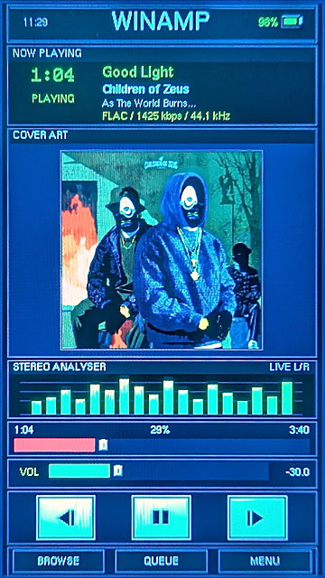

# Winamp 360 — AP80 Pro Max

A **Winamp Classic-inspired Rockbox theme** for the **Hidizs AP80 Pro Max**, drawn for its
360 × 640 portrait display. Dark navy Winamp surfaces, brushed-metal trim, green and
Winamp-yellow accents.

[**Download 1.0**](https://github.com/mr-f0xx/Winamp360-AP80-Pro-Max/releases/latest)

*Now Playing running on the device. Shown at the screen's own 360 x 640.*
(My bad for the really bad screenshot, it obviously looks better on the device itself lol)

## What it is

Winamp 360 is an original Rockbox skin set for the **Hidizs AP80 Pro Max**. It ships a
Now Playing screen (WPS), a menu skin (SBS) and a theme config. The browsable `.rockbox`
directory in this repository is ready to copy straight onto the player.

## Features

**Now Playing**

- Masthead: clock, WINAMP wordmark, battery percentage and icon with matched insets.
- Track window: large elapsed time, title, artist, album and format line.
- **216 × 216 album art** in a 220 × 220 metal frame, evenly padded in its panel, with a
  redesigned no-art fallback.
- **18-column stereo analyser** with the green → Winamp-yellow gradient, alternating
  left/right peak columns.
- Winamp-red seek rail and green volume rail, each with a metal thumb and a large
  touch target.
- Three centred metal transport keys and a direct BROWSE / QUEUE / MENU bar.

**Touch controls**

Every control on Now Playing is tactile — no button combos or scrolling to a
highlighted row first:

| Control | Area | Action |
| ------- | ---- | ------ |
| Previous track | 64 × 48 key | `wps_prev` |
| Play / pause | 64 × 48 key | `play` |
| Next track | 64 × 48 key | `wps_next` |
| Seek bar | full 320 px rail | `progressbar` — drag to scrub |
| Volume bar | full 238 px rail | `volume` — drag to set level |
| BROWSE / QUEUE / MENU | 100 × 25 each | `browse` / `playlist` / `menu` |

The three transport keys and the two rails are deliberately larger than the
graphics they sit on, so they are comfortable to hit with a thumb. The analyser
columns are explicitly marked `notouch`, so they never steal a tap meant for a
control.

**Main menu**

- Winamp navy list surface, Winamp-yellow selected row with dark text.
- No row separators, no scrollbar.
- Footer strip with the current track title, artist and a green play/pause mark.

## Install

1. Copy the contents of `.rockbox/` onto the root of the player's storage, merging with
   the existing `.rockbox` folder, so the paths match:
   - `/.rockbox/themes/Winamp360.cfg`
   - `/.rockbox/wps/Winamp360.wps`
   - `/.rockbox/wps/Winamp360.sbs`
   - `/.rockbox/fonts/` and `/.rockbox/wps/Winamp360/`
2. On the player: **Settings → Theme Settings → Browse Theme Files** and pick
   `Winamp360.cfg`.
3. The four bundled fonts come with the theme; no font pack install needed.

## Colour palette

| Element | Colour |
| ------- | ------ |
| Text / foreground | `#00FF00` green and `#E2E2E8` silver |
| Accent / selection / highlights | Winamp yellow `#E7D42F` |
| Panel interior | `#292941` navy |
| Window background | `#0A0A12` near-black |
| Metal trim | `#68687D` / `#39395A` |
| Seek rail | `#D7443B` Winamp red |

## Notes

- **Target-specific.** Written for the Hidizs AP80 Pro Max and its 360 × 640 portrait
  screen. It is not a portable theme.
- The firmware draws its own USB screen when a cable is connected, and that screen
  cannot be restyled by a theme. The theme's own status bar — the charge bolt and the
  footer warning — stays visible over it.
- Verified with Rockbox's `checkwps` against the `hidizsap80max` target; both the WPS and
  SBS parse cleanly.

## Credits & licence

- Theme layout, fallback artwork, transport icons and slider artwork are original.
- Bundled Rockbox font files are redistributed from the official Rockbox font package,
  with the accompanying notices in `.rockbox/fonts/COPYING-fonts.txt` (GPL / Adobe
  Helvetica licensing as noted there).
- Rockbox and Winamp are trademarks of their respective owners. This is a community
  theme and a visual homage; it is not affiliated with or endorsed by either project or
  company.

## Version history

**1.0** — initial public release.

- Now Playing: masthead, track window, cover art, analyser, seek and volume rails,
  matching transport keys and the quick nav bar.
- Main menu: navy list, Winamp-yellow selection, footer with the track title and artist.
- Charging: charge dashboard, with the bolt keyed on the charger state so it persists
  for the whole charge.
- Includes the fixes that went into this build: contiguous panel fills with no stray
  hairlines, cover art seated evenly in its panel (WPS viewport coordinates are
  absolute), and the track title no longer cleared from the menu footer.
